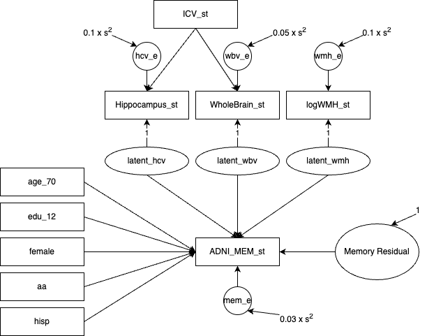
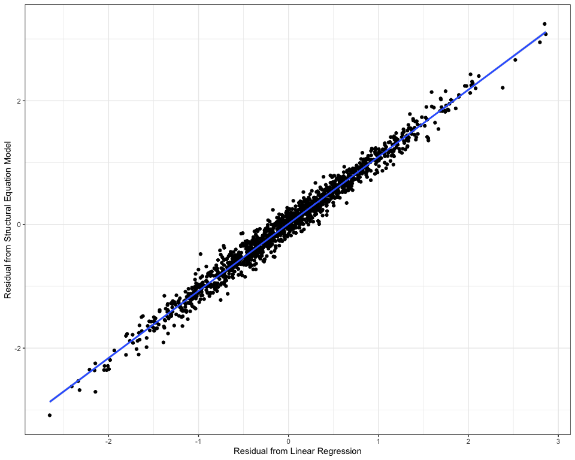
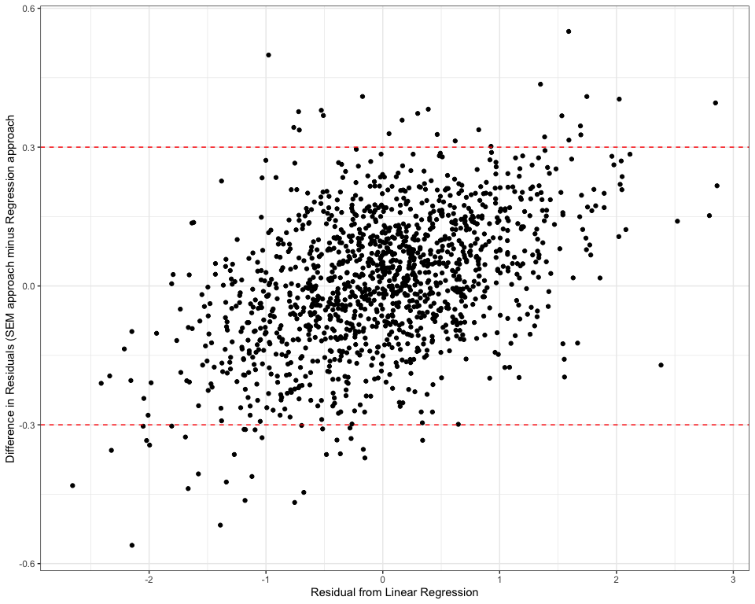
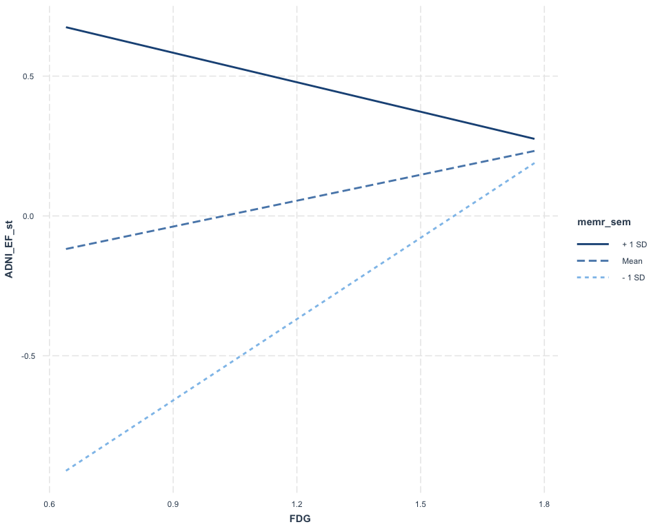

AAIC25 - Cognitive Resilience in Alzheimer’s Disease: Concepts,
Statistical Tools, and Policy Shaping<br><small><em>Residual Cognitive
Reserve using Cross-Sectional Data</em></small>
================
Brandon Gavett, Ph.D.  
Department of Neurology, University of California Davis

2025-07-25

## Building a Residual

### Goal

- To partition variance in a cognitive outcome into three components:
  - Variance explained by brain
  - Variance explained by demographics
  - Residual variance (serves as an estimate of cognitive reserve)

## Building a Residual

### Data Source

The current data are from a synthetic data set modeled after ADNI data.

I used the `synthpop` package in R to generate this simulated data set
to ensure it does not contain any human subjects data or protected
health information.

## Building a Residual

### Cognitive Outcome

- ADNI-Mem composite score (`ADNI_MEM_st`)

[Crane et al. (2012)](https://doi.org/10.1007/s11682-012-9186-z)

## Building a Residual

### Brain Variables

- Hippocampus volume (`Hippocampus_st`)
- Whole Brain volume (`WholeBrain_st`)
- Log-transformed White Matter Hyperintensity volume (`logWMH_st`)
- Intracranial volume (`ICV_st`)

## Building a Residual

### Demographic Variables

- Age, centered at 70 years (`age_70`)
- Education, centered at 12 years (`edu_12`)
- Female sex (`female`)
- Black/African American race (`aa`)
- Hispanic/Latino ethnicity (`hisp`)

## Building a Residual

### Approaches

- Linear Regression
- Structural Equation Modeling

## Install and Load Necessary R Libraries

``` r
# install.packages("pacman") # if necessary
pacman::p_load(dplyr, magrittr, ggplot2, psych, lavaan, interactions)
```

## Import Data

``` r
adni_syn <- readRDS(url("https://github.com/begavett/residual-reserve/raw/refs/heads/main/Data/adni_dat_syn_rc.Rds"))
```

## Examine Data

### Header

The `head` function prints the first 6 rows of a data frame (use
argument `n =` to change the number of rows)

``` r
head(adni_syn)
```

    ##   id  age age_70 edu edu_12 female aa hisp Hippocampus_st WholeBrain_st
    ## 1  1 69.3   -0.7  12      0      1  1    0          0.433       -1.1377
    ## 2  2 85.9   15.9  16      4      0  0    0             NA       -1.3918
    ## 3  3 78.5    8.5  19      7      1  0    0         -0.542       -1.3065
    ## 4  4 72.9    2.9  12      0      1  0    0          1.547       -0.0447
    ## 5  5 75.2    5.2  20      8      0  0    0          1.369       -0.3539
    ## 6  6 66.7   -3.3  19      7      1  0    0          0.809        0.7530
    ##   logWMH_st  ICV_st ADNI_MEM_st ADNI_EF_st  FDG
    ## 1        NA -1.3073      0.7297      0.234 1.11
    ## 2        NA  0.6017     -1.5328     -0.536   NA
    ## 3     0.612 -0.4680     -0.8404     -0.860 1.06
    ## 4    -0.250 -0.2251     -0.1470     -0.838 1.23
    ## 5    -0.254  0.0891      0.0589      0.560 1.31
    ## 6    -0.703 -0.7278      0.8372      1.205 1.38

## Examine Data

### Descriptives

The `describe` function from the `psych` package generates descriptive
statistics.

``` r
describe(adni_syn)
```

    ##                vars    n    mean     sd  median trimmed    mad    min     max
    ## id                1 2359 1219.04 701.57 1219.00 1219.02 901.42   1.00 2434.00
    ## age               2 2355   72.99   7.28   73.00   73.10   7.56  52.70   91.40
    ## age_70            3 2355    2.99   7.28    3.00    3.10   7.56 -17.30   21.40
    ## edu               4 2359   16.09   2.78   16.00   16.23   2.97   4.00   20.00
    ## edu_12            5 2359    4.09   2.78    4.00    4.23   2.97  -8.00    8.00
    ## female            6 2359    0.48   0.50    0.00    0.47   0.00   0.00    1.00
    ## aa                7 2359    0.08   0.26    0.00    0.00   0.00   0.00    1.00
    ## hisp              8 2359    0.05   0.21    0.00    0.00   0.00   0.00    1.00
    ## Hippocampus_st    9 2110    0.00   1.00    0.12    0.03   0.95  -3.40    3.20
    ## WholeBrain_st    10 2309    0.00   1.00   -0.03   -0.02   1.00  -3.35    3.18
    ## logWMH_st        11 1485   -0.01   1.00    0.03    0.03   0.91  -4.64    2.70
    ## ICV_st           12 2359   -0.02   0.92   -0.07   -0.05   0.94  -2.52    3.23
    ## ADNI_MEM_st      13 2353    0.00   1.00    0.05    0.01   1.08  -3.54    3.18
    ## ADNI_EF_st       14 2343    0.00   1.00    0.02    0.01   0.94  -3.26    2.63
    ## FDG              15 1470    1.21   0.15    1.20    1.21   0.15   0.64    1.78
    ##                  range  skew kurtosis    se
    ## id             2433.00  0.00    -1.20 14.44
    ## age              38.70 -0.12    -0.45  0.15
    ## age_70           38.70 -0.12    -0.45  0.15
    ## edu              16.00 -0.60     0.24  0.06
    ## edu_12           16.00 -0.60     0.24  0.06
    ## female            1.00  0.09    -1.99  0.01
    ## aa                1.00  3.21     8.32  0.01
    ## hisp              1.00  4.30    16.48  0.00
    ## Hippocampus_st    6.60 -0.21    -0.10  0.02
    ## WholeBrain_st     6.54  0.16    -0.20  0.02
    ## logWMH_st         7.34 -0.40     0.60  0.03
    ## ICV_st            5.75  0.27    -0.21  0.02
    ## ADNI_MEM_st       6.72 -0.09    -0.44  0.02
    ## ADNI_EF_st        5.89 -0.11    -0.03  0.02
    ## FDG               1.14 -0.11     0.42  0.00

## Linear Regression Approach

### Linear Model

``` r
mem_lm <- lm(ADNI_MEM_st ~ age_70 + edu_12 + female + aa + hisp + 
               Hippocampus_st + WholeBrain_st + logWMH_st + ICV_st,
             data = adni_syn,
             na.action = "na.exclude")
```

The argument `na.action = "na.exclude"` is helpful because it will
prevent missing data errors when merging the residuals back in with our
original data stored in `adni_syn`.

## Linear Regression Approach

### Summary

``` r
summary(mem_lm)
```

    ## 
    ## Call:
    ## lm(formula = ADNI_MEM_st ~ age_70 + edu_12 + female + aa + hisp + 
    ##     Hippocampus_st + WholeBrain_st + logWMH_st + ICV_st, data = adni_syn, 
    ##     na.action = "na.exclude")
    ## 
    ## Residuals:
    ##     Min      1Q  Median      3Q     Max 
    ## -2.6550 -0.5252  0.0055  0.5095  2.8606 
    ## 
    ## Coefficients:
    ##                Estimate Std. Error t value Pr(>|t|)    
    ## (Intercept)    -0.36350    0.05860   -6.20  7.3e-10 ***
    ## age_70          0.00417    0.00368    1.13   0.2569    
    ## edu_12          0.04732    0.00877    5.40  8.1e-08 ***
    ## female          0.33597    0.05383    6.24  5.8e-10 ***
    ## aa             -0.10542    0.08371   -1.26   0.2081    
    ## hisp           -0.16913    0.09665   -1.75   0.0804 .  
    ## Hippocampus_st  0.44886    0.02775   16.17  < 2e-16 ***
    ## WholeBrain_st   0.20417    0.04398    4.64  3.8e-06 ***
    ## logWMH_st      -0.07834    0.02492   -3.14   0.0017 ** 
    ## ICV_st         -0.28207    0.04571   -6.17  9.0e-10 ***
    ## ---
    ## Signif. codes:  0 '***' 0.001 '**' 0.01 '*' 0.05 '.' 0.1 ' ' 1
    ## 
    ## Residual standard error: 0.804 on 1359 degrees of freedom
    ##   (990 observations deleted due to missingness)
    ## Multiple R-squared:  0.331,  Adjusted R-squared:  0.327 
    ## F-statistic: 74.8 on 9 and 1359 DF,  p-value: <2e-16

## Linear Regression Approach

### Extracting the residual

Obtaining residuals from a linear model (`lm`) object simply requires a
call to the `resid` function.

Here, we store the residuals in an object called `mem_resid` and then
visualize the residuals’ distribution using a histogram.

``` r
mem_resid <- resid(mem_lm)

hist(mem_resid)
```

<!-- -->

## Linear Regression Approach

### Saving the residual

Here, we create a new object called `adni_syn_resid`. To create this
object, we begin with the original data frame (`adni_syn`) and apply a
mutation, adding a new column that contains the residuals we had
previously stored in the `mem_resid` object.

``` r
adni_syn_resid <- adni_syn %>%
  mutate(memr_lm = mem_resid)

head(adni_syn_resid)
```

    ##   id  age age_70 edu edu_12 female aa hisp Hippocampus_st WholeBrain_st
    ## 1  1 69.3   -0.7  12      0      1  1    0          0.433       -1.1377
    ## 2  2 85.9   15.9  16      4      0  0    0             NA       -1.3918
    ## 3  3 78.5    8.5  19      7      1  0    0         -0.542       -1.3065
    ## 4  4 72.9    2.9  12      0      1  0    0          1.547       -0.0447
    ## 5  5 75.2    5.2  20      8      0  0    0          1.369       -0.3539
    ## 6  6 66.7   -3.3  19      7      1  0    0          0.809        0.7530
    ##   logWMH_st  ICV_st ADNI_MEM_st ADNI_EF_st  FDG memr_lm
    ## 1        NA -1.3073      0.7297      0.234 1.11      NA
    ## 2        NA  0.6017     -1.5328     -0.536   NA      NA
    ## 3     0.612 -0.4680     -0.8404     -0.860 1.06  -0.754
    ## 4    -0.250 -0.2251     -0.1470     -0.838 1.23  -0.900
    ## 5    -0.254  0.0891      0.0589      0.560 1.31  -0.515
    ## 6    -0.703 -0.7278      0.8372      1.205 1.38  -0.230

## Structural Equation Modeling Approach

<figure>

<figcaption aria-hidden="true">Modeled after Reed et
al. (2010)</figcaption>
</figure>

## Structural Equation Modeling Approach

To generate the residual model using an SEM approach, we will use the
`lavaan` package for R.

For reference, the following operators are used by `lavaan` (lhs = left
hand side; rhs = right hand side)

- `~` - regression of lhs on rhs.
- `~~` - covariance of lhs with rhs. When lhs and rhs are the same
  variable, this is treated as a (residual) variance
- `=~` - loading of rhs on lhs. lhs is the latent factor and rhs is the
  observed variable.
- `0*x` - pre-multiplier. This constrains a parameter to have a fixed
  value. In this example, the parameter for x is fixed to 0.

When using `lavaan`, the model syntax is stored in a character vector.
For example, the following syntax specifies a unidimensional model for a
latent variable called `factor` and 4 observed indicator variables
(`x1 - x4`) loading on the factor.

``` r
model_syntax <- "factor =~ x1 + x2 + x3 + x4"
```

The model syntax is then executed by using one of several functions in
the `lavaan` package:

- `cfa` for models with a measurement component but not a structural
  component
- `sem` for models with a structural component (with or without a
  measurement component)
- `lavaan` for custom models that do not depend on the defaults inherent
  to `cfa` or `sem`

``` r
model_fit <- cfa(model_syntax, data = user_data)
```

Model fit and parameter estimates can be accessed using the `summary`
function.

``` r
summary(model_fit, fit.measures = TRUE, standardize = TRUE)
```

The amount of detail provided can be adjusted by the user.

- `fit.measures = TRUE` prints fit statistics
- `standardized = TRUE` prints standardized parameter estimates
- `rsquare = TRUE` prints $R^2$ statistics
- `ci = TRUE` prints confidence intervals

More on lavaan syntax can be found here:
<https://lavaan.ugent.be/tutorial/syntax1.html>

## Structural Equation Modeling Approach

``` r
resid_lv_mem_model <- "
Hippocampus_st ~ ICV_st # Adjust Hippocampus volume for ICV
WholeBrain_st ~ ICV_st # Adjust Whole brain volume for ICV

# Single indicator latent variable for hippocampus volume
latent_hcv =~ 1*Hippocampus_st # Latent hippocampus indicated by observed HCV
Hippocampus_st ~~ .1*Hippocampus_st # observed HCV has residual variance of .1
latent_hcv ~~ 0*ICV_st # latent HCV uncorrelated with ICV

# Single indicator latent variable for whole brain volume
latent_wbv =~ 1*WholeBrain_st # Latent whole brain vol indicated by observed WBV
WholeBrain_st ~~ .05*WholeBrain_st # observed WBV has residual variance of .05
latent_wbv ~~ 0*ICV_st # latent WBV uncorrelated with ICV

# Single indicator latent variable for white matter hyperintensity volume
latent_wmh =~ 1*logWMH_st # Latent WM hyperintensity indicated by observed WMH
logWMH_st ~~ .1*logWMH_st # observed WMH has residual variance of .1

# regress ADNI_MEM_st on brain and demographic predictors
ADNI_MEM_st ~ latent_hcv + latent_wbv + latent_wmh + female + edu_12 + aa + hisp
ADNI_MEM_st ~~ 0.03*ADNI_MEM_st # set residual variance of ADNI_MEM_st to 0.03

# create residual (mem_r) representing variance not explained by predictors
mem_r =~ NA*ADNI_MEM_st # Loading of ADNI_MEM_st on mem_r freely estimated
mem_r ~~ 1*mem_r # variance of mem_r set to 1

# ensure mem_r is uncorrelated with predictors
mem_r ~~ 0*ICV_st + 0*latent_hcv + 0*latent_wbv + 0*latent_wmh + 0*female +
     0*edu_12 + 0*aa + 0*hisp

# estimate correlations between brain vars & demog vars
latent_hcv + latent_wbv + latent_wmh ~~ female + edu_12 + aa + hisp
female ~~ edu_12 + aa + hisp + ICV_st
edu_12 ~~ aa + hisp + ICV_st
aa ~~ hisp + ICV_st
hisp ~~ ICV_st
latent_wmh ~~ ICV_st

# Fix non-significant covariances to 0, one at a time based on highest p-value
latent_wbv ~~ 0*hisp + 0*aa
latent_wmh ~~ 0*hisp + 0*edu_12 + 0*aa
edu_12 ~~ 0*aa
female ~~ 0*hisp
hisp ~~ 0*ICV_st
aa ~~ 0*hisp
"
```

## Structural Equation Modeling Approach

`sem` is being used here because our model has both measurement and
structural components.

`ml` (maximum likelihood) estimation is requested

`fiml` (full information maximum likelihood) is requested to handle
missing data.

In the `summary`, we request fit measures and standardized parameter
estimates.

``` r
resid_lv_mem_fit <- sem(resid_lv_mem_model, 
                        data = adni_syn, 
                        estimator = "ml", 
                        missing = "fiml")

summary(resid_lv_mem_fit, 
        fit.measures = TRUE, 
        standardized = TRUE)
```

    ## lavaan 0.6-19 ended normally after 68 iterations
    ## 
    ##   Estimator                                         ML
    ##   Optimization method                           NLMINB
    ##   Number of model parameters                        44
    ## 
    ##   Number of observations                          2359
    ##   Number of missing patterns                        11
    ## 
    ## Model Test User Model:
    ##                                                       
    ##   Test statistic                                11.078
    ##   Degrees of freedom                                10
    ##   P-value (Chi-square)                           0.351
    ## 
    ## Model Test Baseline Model:
    ## 
    ##   Test statistic                              4509.059
    ##   Degrees of freedom                                36
    ##   P-value                                        0.000
    ## 
    ## User Model versus Baseline Model:
    ## 
    ##   Comparative Fit Index (CFI)                    1.000
    ##   Tucker-Lewis Index (TLI)                       0.999
    ##                                                       
    ##   Robust Comparative Fit Index (CFI)             1.000
    ##   Robust Tucker-Lewis Index (TLI)                0.999
    ## 
    ## Loglikelihood and Information Criteria:
    ## 
    ##   Loglikelihood user model (H0)             -19960.057
    ##   Loglikelihood unrestricted model (H1)     -19954.518
    ##                                                       
    ##   Akaike (AIC)                               40008.113
    ##   Bayesian (BIC)                             40261.817
    ##   Sample-size adjusted Bayesian (SABIC)      40122.020
    ## 
    ## Root Mean Square Error of Approximation:
    ## 
    ##   RMSEA                                          0.007
    ##   90 Percent confidence interval - lower         0.000
    ##   90 Percent confidence interval - upper         0.024
    ##   P-value H_0: RMSEA <= 0.050                    1.000
    ##   P-value H_0: RMSEA >= 0.080                    0.000
    ##                                                       
    ##   Robust RMSEA                                   0.008
    ##   90 Percent confidence interval - lower         0.000
    ##   90 Percent confidence interval - upper         0.026
    ##   P-value H_0: Robust RMSEA <= 0.050             1.000
    ##   P-value H_0: Robust RMSEA >= 0.080             0.000
    ## 
    ## Standardized Root Mean Square Residual:
    ## 
    ##   SRMR                                           0.011
    ## 
    ## Parameter Estimates:
    ## 
    ##   Standard errors                             Standard
    ##   Information                                 Observed
    ##   Observed information based on                Hessian
    ## 
    ## Latent Variables:
    ##                    Estimate  Std.Err  z-value  P(>|z|)   Std.lv  Std.all
    ##   latent_hcv =~                                                         
    ##     Hippocampus_st    1.000                               0.945    0.934
    ##   latent_wbv =~                                                         
    ##     WholeBrain_st     1.000                               0.666    0.665
    ##   latent_wmh =~                                                         
    ##     logWMH_st         1.000                               0.960    0.950
    ##   mem_r =~                                                              
    ##     ADNI_MEM_st       0.769    0.013   60.188    0.000    0.769    0.772
    ## 
    ## Regressions:
    ##                    Estimate  Std.Err  z-value  P(>|z|)   Std.lv  Std.all
    ##   Hippocampus_st ~                                                      
    ##     ICV_st            0.188    0.021    9.097    0.000    0.188    0.172
    ##   WholeBrain_st ~                                                       
    ##     ICV_st            0.773    0.015   50.763    0.000    0.773    0.713
    ##   ADNI_MEM_st ~                                                         
    ##     latent_hcv        0.545    0.028   19.794    0.000    0.515    0.517
    ##     latent_wbv        0.040    0.037    1.096    0.273    0.027    0.027
    ##     latent_wmh       -0.072    0.025   -2.814    0.005   -0.069   -0.069
    ##     female            0.293    0.037    7.883    0.000    0.293    0.147
    ##     edu_12            0.041    0.006    6.485    0.000    0.041    0.113
    ##     aa               -0.037    0.064   -0.577    0.564   -0.037   -0.010
    ##     hisp             -0.134    0.080   -1.679    0.093   -0.134   -0.028
    ## 
    ## Covariances:
    ##                    Estimate  Std.Err  z-value  P(>|z|)   Std.lv  Std.all
    ##   latent_hcv ~~                                                         
    ##     ICV_st            0.000                               0.000    0.000
    ##   latent_wbv ~~                                                         
    ##     ICV_st            0.000                               0.000    0.000
    ##   mem_r ~~                                                              
    ##     ICV_st            0.000                               0.000    0.000
    ##   latent_hcv ~~                                                         
    ##     mem_r             0.000                               0.000    0.000
    ##   latent_wbv ~~                                                         
    ##     mem_r             0.000                               0.000    0.000
    ##   latent_wmh ~~                                                         
    ##     mem_r             0.000                               0.000    0.000
    ##   mem_r ~~                                                              
    ##     female            0.000                               0.000    0.000
    ##     edu_12            0.000                               0.000    0.000
    ##     aa                0.000                               0.000    0.000
    ##     hisp              0.000                               0.000    0.000
    ##   latent_hcv ~~                                                         
    ##     female            0.030    0.009    3.409    0.001    0.032    0.065
    ##     edu_12            0.372    0.057    6.484    0.000    0.394    0.142
    ##     aa                0.015    0.005    3.145    0.002    0.015    0.058
    ##     hisp              0.008    0.004    2.105    0.035    0.008    0.039
    ##   latent_wbv ~~                                                         
    ##     female           -0.022    0.006   -3.519    0.000   -0.033   -0.065
    ##     edu_12            0.242    0.040    6.048    0.000    0.364    0.131
    ##     aa                0.000                               0.000    0.000
    ##     hisp              0.000                               0.000    0.000
    ##   latent_wmh ~~                                                         
    ##     female           -0.099    0.013   -7.757    0.000   -0.103   -0.206
    ##     edu_12            0.000                               0.000    0.000
    ##     aa                0.000                               0.000    0.000
    ##     hisp              0.000                               0.000    0.000
    ##   female ~~                                                             
    ##     edu_12           -0.222    0.028   -7.784    0.000   -0.222   -0.160
    ##     aa                0.010    0.003    3.888    0.000    0.010    0.078
    ##     hisp              0.000                               0.000    0.000
    ##   ICV_st ~~                                                             
    ##     female           -0.245    0.011  -22.868    0.000   -0.245   -0.532
    ##   edu_12 ~~                                                             
    ##     aa                0.000                               0.000    0.000
    ##     hisp             -0.032    0.012   -2.692    0.007   -0.032   -0.054
    ##   ICV_st ~~                                                             
    ##     edu_12            0.254    0.052    4.889    0.000    0.254    0.099
    ##   aa ~~                                                                 
    ##     hisp              0.000                               0.000    0.000
    ##   ICV_st ~~                                                             
    ##     aa               -0.023    0.005   -4.729    0.000   -0.023   -0.096
    ##     hisp              0.000                               0.000    0.000
    ##   latent_wmh ~~                                                         
    ##     ICV_st            0.205    0.025    8.363    0.000    0.214    0.232
    ##   latent_hcv ~~                                                         
    ##     latent_wbv        0.374    0.017   21.840    0.000    0.594    0.594
    ##     latent_wmh       -0.321    0.027  -11.903    0.000   -0.353   -0.353
    ##   latent_wbv ~~                                                         
    ##     latent_wmh       -0.156    0.021   -7.455    0.000   -0.243   -0.243
    ## 
    ## Intercepts:
    ##                    Estimate  Std.Err  z-value  P(>|z|)   Std.lv  Std.all
    ##    .Hippocampus_st   -0.044    0.021   -2.065    0.039   -0.044   -0.043
    ##    .WholeBrain_st     0.014    0.015    0.971    0.332    0.014    0.014
    ##    .logWMH_st         0.104    0.028    3.683    0.000    0.104    0.103
    ##    .ADNI_MEM_st      -0.293    0.039   -7.432    0.000   -0.293   -0.294
    ##     ICV_st           -0.019    0.019   -1.016    0.310   -0.019   -0.021
    ##     female            0.478    0.010   46.520    0.000    0.478    0.958
    ##     edu_12            4.093    0.057   71.537    0.000    4.093    1.473
    ##     aa                0.075    0.005   13.876    0.000    0.075    0.286
    ##     hisp              0.047    0.004   10.742    0.000    0.047    0.221
    ## 
    ## Variances:
    ##                    Estimate  Std.Err  z-value  P(>|z|)   Std.lv  Std.all
    ##    .Hippocampus_st    0.100                               0.100    0.098
    ##    .WholeBrain_st     0.050                               0.050    0.050
    ##    .logWMH_st         0.100                               0.100    0.098
    ##    .ADNI_MEM_st       0.030                               0.030    0.030
    ##     mem_r             1.000                               1.000    1.000
    ##     ICV_st            0.852    0.025   34.402    0.000    0.852    1.000
    ##     female            0.249    0.007   34.412    0.000    0.249    1.000
    ##     edu_12            7.723    0.225   34.346    0.000    7.723    1.000
    ##     aa                0.070    0.002   34.347    0.000    0.070    1.000
    ##     hisp              0.044    0.001   34.344    0.000    0.044    1.000
    ##     latent_hcv        0.893    0.031   29.105    0.000    1.000    1.000
    ##     latent_wbv        0.443    0.015   30.550    0.000    1.000    1.000
    ##     latent_wmh        0.921    0.038   24.144    0.000    1.000    1.000

## Structural Equation Modeling Approach

### Important Note

One of the key advantages of using the SEM approach instead of the
regression approach is that the residual (`mem_r`) is treated as a
latent variable, thus preventing it from being contaminated by
measurement error. With the regression approach, there is no way to
avoid having the residual also contain measurement error. This may not
be a major problem when all measures (i.e., the cognitive test score
whose variance is being decomposed, the brain variables) are highly
reliable. However, many cognitive measures have higher than desirable
amounts of measurement error, and measurement error in MRI outcomes is
not often known. Therefore, it is usually desirable to use the SEM
approach to exert better control over measurement error to ensure that
the residual itself is also reliable.

However, to validate the residual as a moderator of brain-cognition
associations requires modeling interaction terms. Because the residual
in an SEM model is a latent variable, this requires latent variable
interactions. Unfortunately, latent variable interactions have not been
well developed for the lavaan package (as of version 0.6-19). Therefore,
Mplus is the preferred software package when the goal is to validate the
residual as a moderator of brain-cognition associations.

With lavaan, the most straightforward approach is to save the factor
scores as observed variables and use these in subsequent analyses
(2-step approach). This does not solve the measurement error problem due
to factor score indeterminacy. See [Grice
(2001)](https://psycnet.apa.org/doi/10.1037/1082-989X.6.4.430) for more
details. We will proceed here using the factor scoring approach, but be
mindful that this approach does have limitations.

## Structural Equation Modeling Approach

### Extracting the residual

Factor scores from a `lavaan` model are generated using the `lavPredict`
function.

The default is to use the `regression` factor scoring method. Here, we
specify `method = "Bartlett"` to use the Bartlett factor scoring method.

``` r
model_fscores <- lavPredict(resid_lv_mem_fit, method = "Bartlett")

memr_fscores <- data.frame(model_fscores)$mem_r

hist(memr_fscores)
```

<!-- -->

## Structural Equation Modeling Approach

### Saving the residual

``` r
adni_syn_resid$memr_sem <- memr_fscores

head(adni_syn_resid)
```

    ##   id  age age_70 edu edu_12 female aa hisp Hippocampus_st WholeBrain_st
    ## 1  1 69.3   -0.7  12      0      1  1    0          0.433       -1.1377
    ## 2  2 85.9   15.9  16      4      0  0    0             NA       -1.3918
    ## 3  3 78.5    8.5  19      7      1  0    0         -0.542       -1.3065
    ## 4  4 72.9    2.9  12      0      1  0    0          1.547       -0.0447
    ## 5  5 75.2    5.2  20      8      0  0    0          1.369       -0.3539
    ## 6  6 66.7   -3.3  19      7      1  0    0          0.809        0.7530
    ##   logWMH_st  ICV_st ADNI_MEM_st ADNI_EF_st  FDG memr_lm memr_sem
    ## 1        NA -1.3073      0.7297      0.234 1.11      NA  0.40265
    ## 2        NA  0.6017     -1.5328     -0.536   NA      NA -0.98826
    ## 3     0.612 -0.4680     -0.8404     -0.860 1.06  -0.754 -0.97620
    ## 4    -0.250 -0.2251     -0.1470     -0.838 1.23  -0.900 -1.10818
    ## 5    -0.254  0.0891      0.0589      0.560 1.31  -0.515 -0.82386
    ## 6    -0.703 -0.7278      0.8372      1.205 1.38  -0.230 -0.00634

Note that some rows have missing values in the `memr_lm` column, but
non-missing data in the `memr_sem` column. The SEM approach is more
flexible with missing data handling, and, unlike the `lm` approach, does
not require complete data to estimate a person’s residual.

## Comparison of Approaches

``` r
ggplot(adni_syn_resid, aes(x = memr_lm, y = memr_sem)) +
  geom_point() +
  geom_smooth(method = "lm") +
  theme_bw() +
  xlab("Residual from Linear Regression") +
  ylab("Residual from Structural Equation Model")
```

<!-- -->

## Comparison of Approaches

### Correlation

``` r
cor(adni_syn_resid$memr_lm, adni_syn_resid$memr_sem, 
    use = "pairwise.complete.obs")
```

    ## [1] 0.989

### Bland-Altman Plot

``` r
adni_syn_resid %>%
  mutate(Difference = memr_sem - memr_lm) %>%
  ggplot(aes(x = memr_lm, y = Difference)) +
  geom_point() +
  theme_bw() +
  xlab("Residual from Linear Regression") +
  ylab("Difference in Residuals (SEM approach minus Regression approach") +
  geom_hline(yintercept = c(-.3, .3), colour = "red", lty = 2)
```

<!-- -->

## Validation

### Do our measures of CR moderate cross-sectional brain effects on cognition?

Hypothesized model:

- Outcome: `ADNI_EF_st` [(Gibbons et al.,
  2012)](https://doi.org/10.1007/s11682-012-9176-1) - a composite
  measure of executive functioning
- Predictor: `FDG` - FDG-PET metaROI (posterior cingulate, angular
  gyrus, inferior temporal gyrus)
- Moderator: `memr_sem` - Residual cognitive reserve variable from the
  SEM model above
- Covariates: same variables that were used to build the residual
  (demographics and brain)

``` r
ef_memr_sem <- lm(ADNI_EF_st ~ age_70 + edu_12 + female + aa + hisp + 
                    Hippocampus_st + WholeBrain_st + logWMH_st + ICV_st + 
                    FDG * memr_sem, 
                   data = adni_syn_resid)

summary(ef_memr_sem)
```

    ## 
    ## Call:
    ## lm(formula = ADNI_EF_st ~ age_70 + edu_12 + female + aa + hisp + 
    ##     Hippocampus_st + WholeBrain_st + logWMH_st + ICV_st + FDG * 
    ##     memr_sem, data = adni_syn_resid)
    ## 
    ## Residuals:
    ##     Min      1Q  Median      3Q     Max 
    ## -2.3054 -0.4606 -0.0156  0.4673  2.6820 
    ## 
    ## Coefficients:
    ##                Estimate Std. Error t value Pr(>|t|)    
    ## (Intercept)    -0.45321    0.23168   -1.96  0.05073 .  
    ## age_70         -0.01258    0.00396   -3.17  0.00155 ** 
    ## edu_12          0.03963    0.00964    4.11  4.3e-05 ***
    ## female          0.13281    0.05873    2.26  0.02396 *  
    ## aa             -0.40346    0.11688   -3.45  0.00058 ***
    ## hisp           -0.41753    0.10833   -3.85  0.00012 ***
    ## Hippocampus_st  0.24364    0.03099    7.86  1.0e-14 ***
    ## WholeBrain_st   0.10339    0.04776    2.16  0.03064 *  
    ## logWMH_st      -0.06875    0.02779   -2.47  0.01352 *  
    ## ICV_st         -0.13425    0.04918   -2.73  0.00645 ** 
    ## FDG             0.27207    0.18813    1.45  0.14846    
    ## memr_sem        1.36807    0.21016    6.51  1.2e-10 ***
    ## FDG:memr_sem   -0.74286    0.17044   -4.36  1.5e-05 ***
    ## ---
    ## Signif. codes:  0 '***' 0.001 '**' 0.01 '*' 0.05 '.' 0.1 ' ' 1
    ## 
    ## Residual standard error: 0.734 on 948 degrees of freedom
    ##   (1398 observations deleted due to missingness)
    ## Multiple R-squared:  0.404,  Adjusted R-squared:  0.397 
    ## F-statistic: 53.6 on 12 and 948 DF,  p-value: <2e-16

## Validation

### Moderation effects

``` r
interact_plot(ef_memr_sem, pred = FDG, modx = memr_sem)
```

<!-- -->
